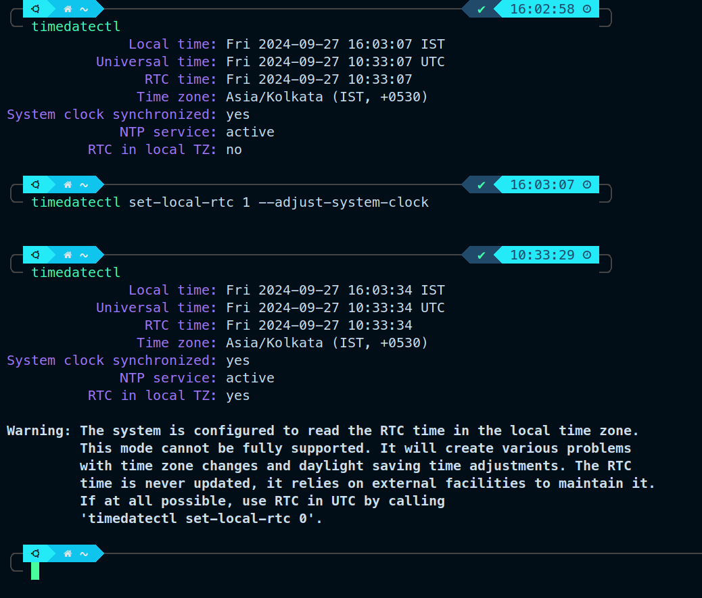

# my-linux

UBUNTU -> need to install fonts (mesloNerd and ...)

1. necessary nvidia drivers

1. copy .zshrc, aliases and config files

1. vscode

1. ssh files

1. oh-my-zsh

1. ocaml, haskell (maybe) ...

1. Latex, python, anaconda, jupyter notebook (comes with anaconda ?? ) , texworks

1. install npm, node, javacript, python

1. neovim (with icon packs and themes)

1. tmux and tmux config and tmux alias

1. install gnome-tweaks, gnome-shell-manager(gnome-shell-extension-manager ??), gpaste-client, gitk, tig, neofetch

1. install homebrew for linux

1. if we want to use clipboard to use in vim [https://stackoverflow.com/questions/3961859/how-to-copy-to-clipboard-in-vim](https://stackoverflow.com/questions/3961859/how-to-copy-to-clipboard-in-vim)

1. [https://ubuntuhandbook.org/index.php/2022/06/touchpad-gestures-ubuntu-22-04-xorg/](https://ubuntuhandbook.org/index.php/2022/06/touchpad-gestures-ubuntu-22-04-xorg/) for
   enabling touchpad gestures in ubuntu if not automatically enabled

1. To install Latex,first follow this website [https://linuxhint.com/install-latex-ubuntu/](https://linuxhint.com/install-latex-ubuntu/) and then
   the video [https://www.youtube.com/watch?v=4bE7UUE7d7w](https://www.youtube.com/watch?v=4bE7UUE7d7w) till 11:43

1. for nvim clipboard to work, install xclip

1. install vim and, and check
   `vim --version | grep`

   if it shows `-clipboard`, then install
   vim-gtk3 for enabling vim clipboard
   for hp ubuntu set clipboard unnamedplus kind of not working, hence select the lines and then :w xclip -i -sel c

1. SmoothCursor.nvim can be installed if necessary

1. Search Light extension

1. `eza` - Better `ls` and `zoxide` - Better `cd`
   [https://www.josean.com/posts/how-to-setup-alacritty-terminal](https://www.josean.com/posts/how-to-setup-alacritty-terminal)

1. alacritty might be necessary for using sway, - [https://github.com/alacritty/alacritty/tree/master][https://github.com/alacritty/alacritty/tree/master]
   installation of alacritty for ubuntu can be found in the above link,

1. rustup for alacritty and cargo ?

1. [https://www.youtube.com/watch?v=sdSFzZCgWp0&t=83s](https://www.youtube.com/watch?v=sdSFzZCgWp0&t=83s)

1. postgres and pgAdmin

1. TLA plus, NuSMV,

1. docker

1. for using clipboard in vim in sway session, install wl-clipboard using the below command

1. if wayland didn't work as expected, remove trailing commas in configuration files and reboot

1. if on using sway, the applications are opening in light mode, switch back to gnome and using gnome-tweaks, change settings of appearance to Adwaita and Adwaita Dark

```
sudo apt install wl-clipboard
```

1. READ [SWAY README](./sway_README.md)

1. **IMPORTANT** SCREENSHARING IN SWAY WINDOW MANAGER

[https://forum.endeavouros.com/t/unable-to-share-screen-with-sway-wm/46654/4](https://forum.endeavouros.com/t/unable-to-share-screen-with-sway-wm/46654/4)

[https://soyuka.me/make-screen-sharing-wayland-sway-work/](https://soyuka.me/make-screen-sharing-wayland-sway-work/)

TL;DR \\
Install `xdg-desktop-portal-wlr` and `xdg-desktop-portal` (`mako`, `wdisplays` not sure)

In the file `/etc/sway/config.d/50-systemd-user.conf`, we should have something similar like the below

```
exec systemctl --user import-environment DISPLAY WAYLAND_DISPLAY SWAYSOCK XDG_CURRENT_DESKTOP
exec hash dbus-update-activation-environment 2>/dev/null && \
     dbus-update-activation-environment --systemd DISPLAY WAYLAND_DISPLAY SWAYSOCK XDG_CURRENT_DESKTOP XDG_CURRENT_DESKTOP=sway
```

And then restart the computer

Follow the points, mentioned here [https://forum.endeavouros.com/t/unable-to-share-screen-with-sway-wm/46654/5](https://forum.endeavouros.com/t/unable-to-share-screen-with-sway-wm/46654/5)

1. if using dual boot, then windows time and ubuntu time might be out of sync. [blog](https://www.howtogeek.com/323390/how-to-fix-windows-and-linux-showing-different-times-when-dual-booting/)
   Make windows use automatic time sync and then check the below screenshot



```
timedatectl set-local-rtc 1 --adjust-system-clock
```

1. check out [sudo-password-caching-time](./time-caching-for-sudo.md)

## For Kali Linux

1. only homebrew, vim, vimrc, gcc, vscode

1. When installing vim and neovim, old versions were being installed. Had to go to the github page and then install from the package

1. xclip was required to use system clipboard for neovim

## For Arch Linux

1. Check whichever is required, which are mentioned for Ubuntu

1. Check out [https://www.youtube.com/watch?v=odgD_RdJjCU](https://www.youtube.com/watch?v=odgD_RdJjCU) and
   [https://www.youtube.com/watch?v=V7ABBlXcn0g](https://www.youtube.com/watch?v=V7ABBlXcn0g)

1. tmux first line is not necessary ?

1. for night owl, theme in gnome-terminal, replace `fgrep` with `grep -F`

### For installing the whole OS in a pendrive

1. [https://www.youtube.com/watch?v=j2RYqahtkNc&t=43s](https://www.youtube.com/watch?v=j2RYqahtkNc&t=43s) For Ubuntu

1. [https://www.youtube.com/watch?v=\_5vv3j-dW4o](https://www.youtube.com/watch?v=_5vv3j-dW4o) For Debian

1. [https://www.youtube.com/watch?v=yYyh3PrIB7w](https://www.youtube.com/watch?v=yYyh3PrIB7w) For Arch
